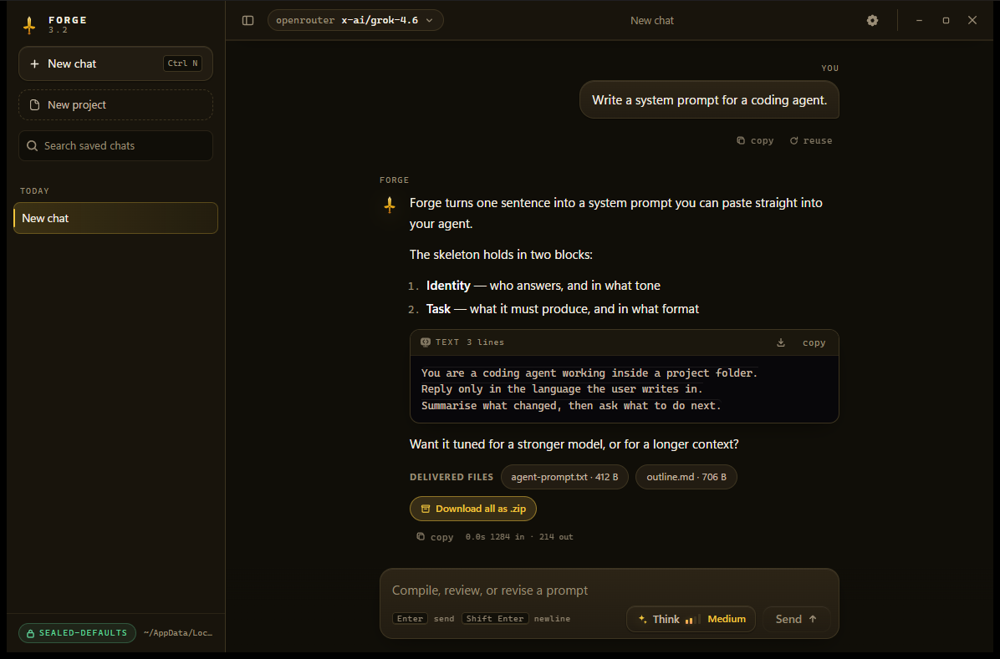
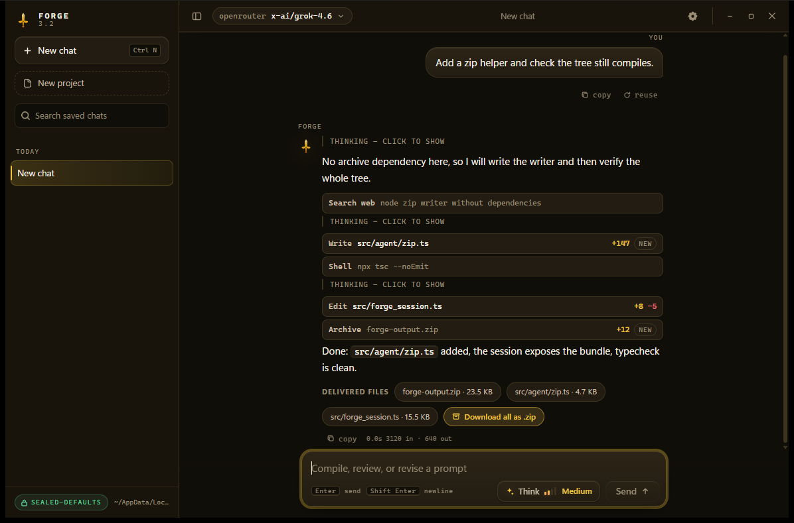

# Forge 3.2

Forge 3.2 is a desktop prompt workshop presented as a focused chat application.
Describe a goal, receive a complete ready-to-run system prompt, then keep revising
the same draft through normal conversation.

This release replaces the terminal interface with a native desktop window and a
saved-chat rail. The Forge drafting engine remains the mouth behind the UI.



An agent turn reads in the order it happened — thinking, what it said, the
tool it ran — with a line stat on every file it touched:



## Download

Prebuilt binaries are not committed to the repository — build them locally:

| Target | Command | Output |
|---|---|---|
| Windows x64, single file | `npm run pack:exe` | `release/Forge-3.2-windows-x64.exe` |
| Any platform, from source | `npm run build && node dist/main.js` | — |

Release artifacts keep the names `Forge-3.2-windows-x64.exe`,
`Forge-3.2-linux-x64`, `Forge-3.2-macos-arm64`, and `Forge-3.2-macos-x64`.

## What changed in 3.2

- Venice is now actually selectable. It shipped as a backend with all 128 of
  its models listed and none of them reachable, because the picker is a curated
  allowlist it was missing from. Every one of those models is free, and the
  list now includes `abliteration-abliterated-model-large-v2`
- Qwen is offered from four providers: OpenRouter, OrcaRouter, DashScope and
  Venice
- The `tests/` folder is no longer in this repository. It stays on the
  maintainer's machine and is gitignored; a clone still builds and runs, only
  `npm test` needs those files locally
- Bring your own provider: add any OpenAI- or Anthropic-shaped endpoint under
  Settings → API keys, including a self-hosted llama.cpp or vLLM box that needs
  no key. Its models join the picker and can be pinned like any other
- The Forge instructions stay private. A rule goes in front of every turn, and a
  redaction pass removes the instructions from a reply wherever they appear —
  including a mid-answer copy and a French paraphrase
- NVIDIA works again, Nemotron and the GLM models included. Forge was sending
  it a `reasoning` budget it does not accept, which came back as HTTP 200 with
  the refusal hidden inside the stream; failures reported inside a stream are
  now surfaced properly; and the queued GLM models are no longer cut off while
  they wait in silence. A 503 from a busy endpoint is retried rather than shown
- The whole app is animated now, not just the setup: buttons and rows answer
  the pointer, theme cards spring when chosen, changing theme cross-fades
  instead of cutting, Settings panes slide in, and the reasoning block
  unfolds. Reduced-motion preferences turn all of it off
- A welcome setup on the very first launch: pick a theme, paste the provider
  keys you use, press **Finish**, and you are in. It runs once, never
  returns, and `Skip` lets you walk past it. Everything on those screens stays
  editable under Settings
- The setup is animated like the rest of the app: the sheet rises, steps slide
  the way you walked them, themes and key rows arrive in sequence, and a saved
  key washes green. Reduced-motion preferences turn all of it off
- Removed local-model and Ollama choices from model and provider settings
- Replaced retired OpenRouter `x-ai/grok-4-fast` with live `x-ai/grok-4.6`
- Refreshed every provider catalog against live APIs on 2026-09-29 and remapped
  48 dead pins onto live replacements. NVIDIA advertises 81 ids but most are
  embeddings, rerank, OCR, ASR and image NIMs that answer 404 on
  `/chat/completions`; the picker carries the 15 free-endpoint text models that
  were probed live
- The hosted model tables learned which models actually reason, so a turn no
  longer claims "has no thinking" above a reasoning block it just rendered
- Interleaved fallback models so one broken endpoint cannot consume every retry
- Routed every hosted provider through the operating-system certificate store
- Added frozen Linux Qt backend verification before publication
- Renamed the app and its artifacts to 3.2 (`Forge-3.2-windows-x64.exe`); a 3.1
  install is merged into the new data folder on first run — chats, keys,
  history and sandboxes are all imported, existing 3.2 files always win, and
  the old folder is never deleted
- Deleting a chat deletes the files that chat produced
- Projects: a project owns one folder on this PC, its chats nest under it in the
  sidebar, and every folder is picked with the in-app browser (no native dialog)
- Frameless window with the controls in the app header, six themes, and press,
  ripple, modal, and row animations that all respect `prefers-reduced-motion`
- Agent runs show their work in the discussion — the turn reads in the order it
  happened: thinking, what it said, the tool it ran, then thinking again. Tools
  are listed inline with a `+8 -5` stat on file writes, and the folded
  one-line summary stays at the top
- Agent turns stream their text while the model writes it, instead of releasing
  everything in one lump at the end and looking frozen
- The Forge prompt is now injected into **every** turn. Plain chat used a bare
  two-line system prompt and the agent a generic "coding agent" header; the
  sealed identity (or the persona edited in Settings) now leads the system prompt
- A `Think` control in the composer cycling Off / Low / Medium / High / Max,
  with a four-bar meter that reads full at Max and maps per model family
- Long code blocks fold like the reasoning line — name, line count, and a
  `show all` toggle — and every block carries a download button
- Per-model reply budgets: the provider is asked first, the family table is the
  fallback, and stale `chat_max_tokens` is retired
- Security and reliability hardening, see [SECURITY.md](SECURITY.md)

## Agent tools

A tool-capable turn runs in a private per-session sandbox. Shell and web are
always offered and ask for permission the first time they are used.

| Tool | What it does |
|---|---|
| `list_files` / `read_file` / `search_files` | Inspect the workspace |
| `write_file` / `replace_in_file` | Create and edit files |
| `run_command` | Run a shell command (asks first) |
| `web_search` / `web_fetch` | Search and read the web (asks first) |
| `make_zip` | Bundle the workspace into a `.zip` the user downloads |
| `ask_user` | Ask a question only the user can answer |

Files a turn stages are listed under **Delivered files** and can be downloaded
one by one, or as a single archive with **Download all as .zip**. Stopping a
turn keeps the text it already wrote and the files it already staged.

## Your own instructions

Settings → **Prompts** holds a prompt of your own. Typing saves on its own;
**Save** files it as a named entry you can pick back with one click or delete.
**Forge** is listed first as the default, selected whenever the box is empty,
and cannot be removed. Switch a prompt on and it is injected in front of every
turn — draft, review, chat and agent alike — placed after Forge's own prompt so
it reads as the final instruction. Switch it off and your text stays on this
machine without going anywhere.


## Core chat release

- Full chat layout with streaming responses and Markdown rendering
- Saved workshop threads with rename, search, reopen, and delete
- Projects and per-conversation folders with an in-app folder browser
- Model picker covering verified hosted providers
- Separate Forge configuration and encrypted local chat history
- Stronger PURPOSE / ROLE / TASK / OUTPUT prompt compilation
- Refusal recovery and document-continuation retry rails
- Thinking effort control: one generic scale (off/low/medium/high/max) that each
  model family maps to its own native knob — token budget, effort level, or
  thinking level — with the level shown on the waiting line
- Capability-aware thinking: a model that cannot think runs the turn with
  thinking off, a model that always reasons runs at its lowest level, and the
  chat says in plain words which level it actually got
- Agent mode with permission prompts for shell and web tools, plus a foldable
  run trace (steps, tool arguments, and results) kept with the finished turn
- When the model asks a question, the proposals become numbered rows and a
  free answer sits underneath. Passing — with the close control, the backdrop,
  Escape or the **Pass** button — tells the model the question was passed and
  that it must move on; a repeat of a passed question is answered by the engine
  and never shown again
- The run trace streams its text live while the model writes, so a long
  max-effort turn shows its work instead of a frozen status line
- Runtime stop that cancels the stream, kills running shell commands, and
  aborts in-flight web fetches
- Runs natively on Windows, Linux, and macOS from source; Windows also gets a
  single-file executable

## Run from source

The desktop window, the chat runtime, and the prompt engine are written in
TypeScript and run on Node.js 20 or newer. No Python installation is involved.

For a source checkout, `forge.bat` installs the Node dependencies and builds the
app on its first run, then starts the native window:

```bash
git clone https://github.com/JusDeFruis/Forge-3.1-Test-TS.git
cd Forge-3.1-Test-TS
```

Windows:

```powershell
.\forge.bat
```

Linux / macOS:

```bash
./forge.sh
```

Both launchers are equivalent to:

```bash
npm install
npm run build
node dist/main.js
```

## Local data

Forge stores chats, model selection, generated history keys, and provider API
keys under `%APPDATA%\Forge-3.2` on Windows, `$XDG_CONFIG_HOME/forge-3.2`
(or `~/.config/forge-3.2`) on Linux and macOS, or the `FORGE3_DIR` override.
An existing `~/.forge-3` folder from a previous install is copied over
automatically on first run. Provider API keys are read from that key directory
or environment variables. Credentials and chat history are never stored in this
repository.

A provider added under **Settings → API keys → Your own providers** is stored
the same way: its definition sits in `config.json`, its key goes to
`keys/<id>.txt` beside the built-in ones, and both stay on this machine. The
definition never holds the key.

Chat history is encrypted at rest with a generated key kept beside it, and the
history and secret files are created owner-only. See
[SECURITY.md](SECURITY.md) for the full list of hardening measures and the
reporting process.

## Development

```bash
npm run typecheck
npm test
npm run dev
```

`npm run typecheck` runs `tsc --noEmit` over the whole tree, `npm test`
rebuilds, typechecks, and runs the `node:test` suite in `tests/`, and
`npm run dev` builds and starts the window. `npm run start` runs the built app
directly.

There is no CI workflow in this tree: run `npm test` on every platform you
target before pushing — the suite builds, typechecks, and exercises the chat
engine, the bridge allowlist, and the security invariants.

**The `tests/` folder is not in this repository.** It is a local development
harness, kept on the maintainer's machine and listed in `.gitignore`. Nothing
in `src/`, `web/` or the build depends on it, so a clone builds and runs
normally; only `npm test` needs those files present locally.

### Windows executable

```bash
npm run pack:exe
```

`pack:exe` writes `release/Forge-3.2-windows-x64.exe`, a single file that
embeds the Node runtime, the web shell, and the webview native library, so it
runs on any Windows x64 machine without a Node.js install. The launcher stamps
the `forge.ico` icon and the `3.2.0` version resources before injecting the
payload. Windows SmartScreen asks for "More info" then "Run anyway" on unsigned
builds.

## Maintainer

Created by [twaai](https://github.com/twaai), developed and maintained by
[JusDeFruis](https://github.com/JusDeFruis). The same credits ship in the app
under Settings → Credits.

## Legal

Forge is private and proprietary. Copyright 2026 twaai. All rights reserved.

The copyright holder grants a limited, revocable permission to **run** Forge,
without copying it and without redistributing it, solely to test systems you
own or that you have explicit written permission to test.

**Authorized use only.** Do not use Forge to attack systems you do not own, or
to handle material you are not permitted to hold. Model output is untrusted
input — review it before acting on it.

Forge is provided "as is", without warranty of any kind. The authors are not
responsible for direct or indirect damages, data loss or corruption, including
files the agent writes, unauthorized use or misuse, and security
vulnerabilities. By using it you accept full legal responsibility for your
actions; consult a lawyer if unsure. Nothing in the LICENSE file limits rights
that cannot lawfully be waived.

See [LICENSE](LICENSE) for the full text, [SECURITY.md](SECURITY.md) to report
a vulnerability privately, and [NOTICE](NOTICE) for third-party components.
